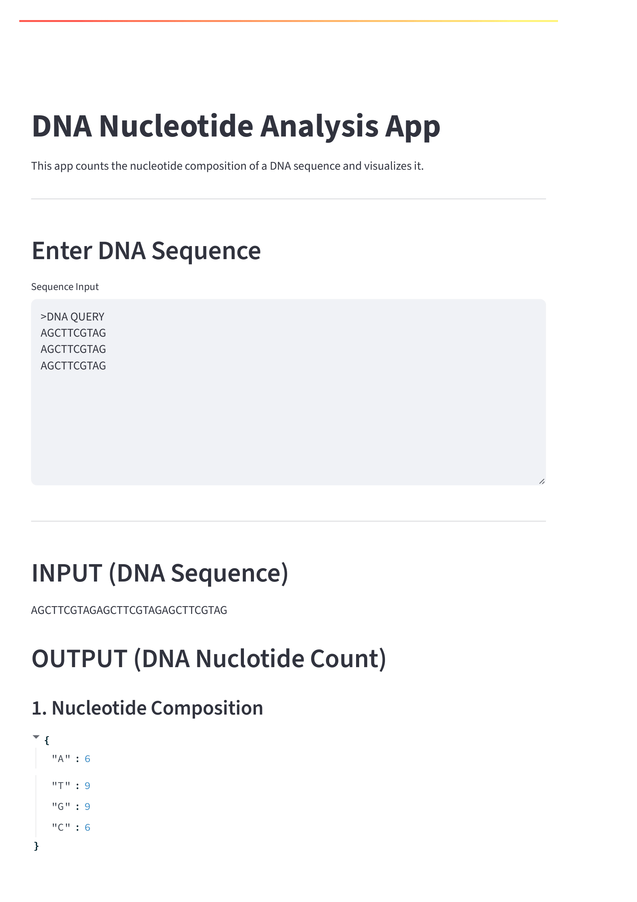
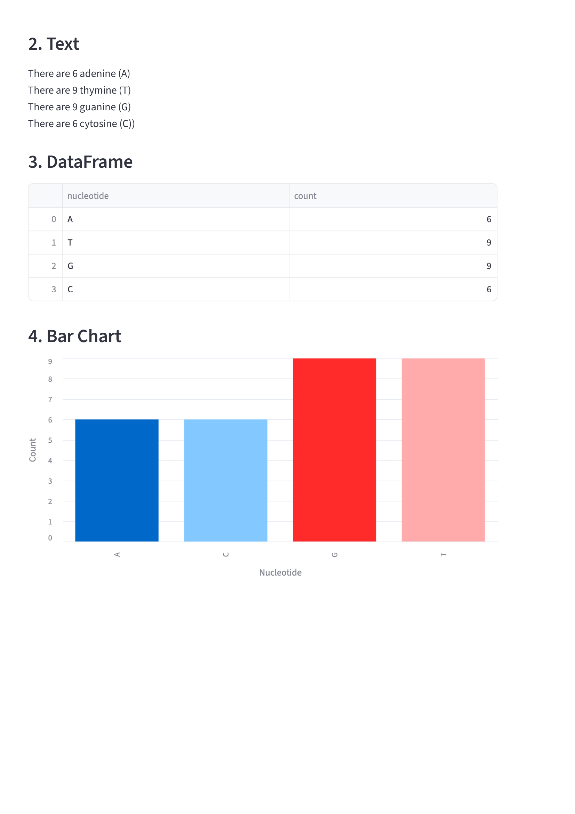

# Simple Bioinformatics DNA Nucleotide Count

Streamlit app counting the nucleotide composition of query DNA




## Description

This application analyzes DNA sequences and provides detailed nucleotide composition analysis. It counts the occurrences of each nucleotide (Adenine, Thymine, Guanine, and Cytosine) in your input DNA sequence and displays the results in a user-friendly interface.

### Features

- **DNA Sequence Analysis**: Input any DNA sequence for analysis
- **Nucleotide Counting**: Automatically counts A, T, G, and C nucleotides
- **Visual Results**: Clear display of nucleotide frequencies and percentages
- **Built with Streamlit**: Interactive web-based interface

## Requirements

- Python 3.7 or higher
- Streamlit
- Pandas (for data manipulation)

## How to Run

1. Install dependencies:
   ```
   pip install -r requirements.txt
   ```

2. Run the app:
   ```
   streamlit run dna-app.py